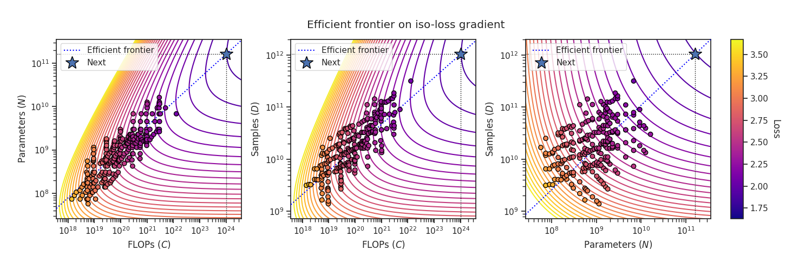

# `chinchilla`



`chinchilla` is a research toolkit designed to estimate scaling laws & train compute-optimal models for various deep learning tasks.

## Features

- **Scaling Law Estimation**: Fit a loss predictor based on multiple training runs.
- **Compute-Optimal Allocation**: Train the best possible model within a given compute budget.
- **Progressive Scaling**: Iteratively update the scaling law estimation and scale up the compute.
- **Simulation Mode**: Test scaling law estimations in hypothetical scenarios.

<table>
<tr>
  <td>

**Expected Use Cases**:

  </td>
  <td>

- Scaling compute for
  - Large Language Models (LLM)
  - Vision Transformers (ViT)
  - Reinforcement Learning (RL)
  - Embedding Models
  - Knowledge distillation
- Evaluating compute efficiencies of new algorithms & architectures
- Researching the neural scaling law itself

</td>
<tr>
  <td>

  Probably **NOT** For...
  </td>
  <td>

- Fine-tuning tasks
- Data-scarce domains
- etc.

  </td>

</tr>
</table>

> [!IMPORTANT]
> This work builds upon the scaling law formulation proposed in [the original Chinchilla paper](https://deepmind.google/discover/blog/an-empirical-analysis-of-compute-optimal-large-language-model-training/) by DeepMind (2022),
> with some modifications detailed in [./docs/changes.md](https://github.com/kyo-takano/chinchilla/tree/master/docs/changes.md).

## Installation

**From PyPI**

```bash
pip install -U chinchilla
```

**From Source**

```bash
git clone https://github.com/kyo-takano/chinchilla.git
cd chinchilla
pip install -e .
```

## Prerequisite: Chinchilla formulation

Just in case you are not familiar, here is the formulation of the scaling law estimation:

<details>

<summary style="font-weight: bold;">Variables</summary>

- $N$: The number of parameters
- $D$: The number of data samples
- $C$: Total compute in FLOPs ($C\approx 6\ ND$)
- $L(N,\ D) = E + A / N ^ \alpha + B / D ^ \beta$: A loss predictor parameterized by $\{E, A, B, \alpha\}$ and $\beta$

  ---

  **Intuition**:
  - $E$ corresponds to the **irreducible loss** that can only be atained with an ideal model with infinite compute
  - $A / N ^ \alpha$ accconts for the additional loss coming from insufficiency of model size;
  - $B / D ^ \beta$, insufficiency of data amount.

</details>

<details>

<summary style="font-weight: bold;">Objective</summary>

1. Optimize the parameters $\{E, A, B, \alpha, \beta\}$ to better predict losses $L_i$ from $(N_i, D_i)$
2. Solve $\underset{N,\ D}{argmin}\ L(N,\ D\ |\ C)$, which can be derived from $\{A, B, \alpha, \beta\}$

</details>

## Usage

### 1. Fitting the scaling law on existing dataset

> [!NOTE]
> An example of this usage can be found [here](https://github.com/kyo-takano/chinchilla/blob/master/examples/llm/main.ipynb)

First, prepare a CSV looking like this and save it as `df.csv`:

```csv
C,N,D,loss
1.3972367362937152e+18,73824672,3154403320,3.405928
1.7656304230443515e+18,89818214,3276303602,3.325255
2.0558971596900728e+18,105811837,3238291053,3.300442
...
```

Second, define a grid of initial parameters to fit like:

```python
import numpy as np
from chinchilla import Chinchilla
cc = Chinchilla(
    "./",  # Assuming `df.csv` is under ./
    param_grid=dict(
        E=np.linspace(1, 2, 5),
        a=np.linspace(1, 10, 5),    # a: log(A)
        b=np.linspace(1, 10, 5),    # b: log(B)
        alpha=np.linspace(0.1, 0.7, 5),
        beta=np.linspace(0.1, 0.7, 5),
    ),
)
```

Finally, call `cc.fit()` & you'll get the parameters fit on your dataset, which you can easily access as `cc.params`

```python
>>> cc.fit()
>>> cc.params
{'E': 1.7004437920205586,
 'A': 185.388090185727,
 'B': 1627.0012474587165,
 'alpha': 0.28923265350161337,
 'beta': 0.3556020928031086}
 ```

By calling `cc.scale` with FLOPs specified like

```python
cc.allocate_compute(C=1e24)
```

You can get an estimatedly compute-optimal allocation of compute to $N$ and $D$.

### 2. Scaling from scratch

> [!NOTE]
> An example of this usage can be found [here](https://github.com/kyo-takano/chinchilla/blob/master/examples/efficientcube.ipynb)

> **Procedure**:
>
> - `seed`: Sample X training runs $(N_i, D_i, L_i)$, referred to as **seeds**
> - For i = 0 to K:
>   - `fit`: Optimize the scaling law parameters to fit $L(N,\ D)$ on the training runs
>   - `scale`: Configure a new model with a **scaled** compute
>   - Evaluate the allocation by training a model
>   - `append`: Add the result to the database of training runs

Below is an example to get started with `chinchilla`.

```python
import numpy as np
from chinchilla import Chinchilla

cc = Chinchilla(
    "your_project__dir",
    param_grid=dict(
        E=np.linspace(1.1, 1.5, 5),
        A=np.linspace(200, 1000, 5),
        B=np.linspace(200, 1000, 5),
        alpha=np.linspace(0.1, 0.5, 5),
        beta=np.linspace(0.1, 0.5, 5),
    ),
    seed_ranges=dict(C=(1e15, 1e16), N_to_D=(10, 100)),
    # To search for the model configuration with N closest to suggested:
    model_search_config=dict(
        hyperparam_grid=dict(
            hidden_size=list(range(64, 16384 + 1, 64)),
            num_hidden_layers=list(range(1, 50 + 1)),
            num_heads=list(range(1, 40 + 1)),
        ),
        size_estimator=estimate_model_size,  # You gotta define a function to estimate & return model size also
    ),
    # Parameters you may pre-set
    num_seeding_steps=100,
    scaling_factor=2.0,
)


# Run the scaling law estimation and training process
for i in range(100 + 5):
    # Sample a new model
    (N, D), model_config = cc.step(num_seeding_steps=100)

    # Define a model
    model = YourModelClass(**model_config)

    # Train & evaluate the allocation C => (N, D)
    loss = train_and_evaluate(model, D)

    # Finally, append the training run into the database
    cc.append(N=N, D=D, loss=loss)
```

Ensure you define functionally equivalent versions of:

- `estimate_model_size`: Estimates and returns the model size.
- `YourModelClass`: Your model class definition.
- `train_and_evaluate`: Function to train and evaluate your model.

<details>

<summary style="font-size: 1.5rem; font-weight: bold;"> Simulation Mode</summary>

You can also visualize how `chinchilla` would perform under the given setup and a hypothetical scaling law, optionally with a **_noise term_**:

```python
import random

cc.simulate(
    num_seeding_steps=401,
    num_scaling_steps=1,
    scaling_factor=10.0,
    target_params=dict(
        E=1.69337368,
        A=406.401018,
        B=410.722827,
        alpha=0.33917084,
        beta=0.2849083
    ),
    # Add exponentially distributed loss averaging at 0.1
    noise_generator=(random.expovariate, (10,))
)
```

</details>

## Examples

Find practical applications/examples of `chinchilla` in the [`examples`](https://github.com/kyo-takano/chinchilla/tree/master/examples) directory (more to come):

- [Allocating $10^{24}$ FLOPs to a single LLM](https://github.com/kyo-takano/chinchilla/blob/master/examples/llm) [NEW]

- [Scaling Rubik's Cube Solvers from Scratch](https://github.com/kyo-takano/chinchilla/blob/master/examples/efficientcube.ipynb)

## Documentation

- [API Reference](https://github.com/kyo-takano/chinchilla/tree/master/docs/api-reference.md)

- [Tips](https://github.com/kyo-takano/chinchilla/tree/master/docs/TIPS.md)

- [Math](https://github.com/kyo-takano/chinchilla/tree/master/docs/math.md)

- [Differences from the original Chinchilla](https://github.com/kyo-takano/chinchilla/tree/master/docs/changes.md)

## Contributing

We welcome your contributions.
Please report bugs and suggest improvements through new issues and pull requests.
