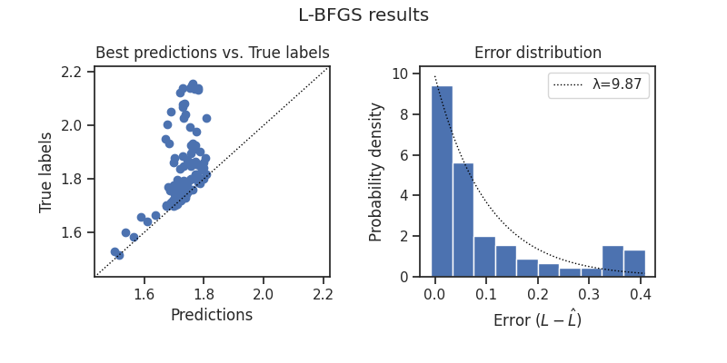
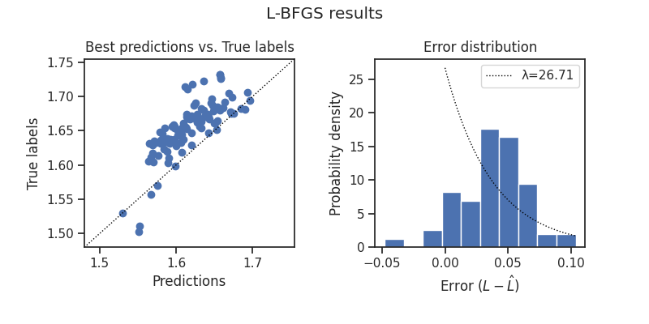

# Tips / Best Practices

Here are a few tips and best practices for both using `chinchilla` and training large-scale NNs in general.

## chinchilla-specific

### 1. Be specific on `param_grid`

To fit a loss predictor $L(N, D | A, B, \alpha, \beta)$ (`Chinchilla.fit`) on existing training runs,
it is crucial to define a `param_grid` of initial values carefully.
The optimization of these values through L-BFGS aims to align predicted losses $\hat{L_{i}}$ closely with actual losses $L_{i}$, and given the sensitivity of the optimization algorithm, a tiny adjustment of a value in the initialization grid can significantly impact the result.

To mitigate estimation instability:

- Utilize prior knowledge of expected losses for given $N$ and/or $D$
- If no clue, inform your parameter grid from seed training runs

Prior knowledge of expected losses for a given $N$ and/or $D$ can guide you in setting realistic upper and lower bounds for these parameters, enhancing the precision of your grid. 
For example, the cross-entropy loss can go below 1.5 for an LM with 32000 vocabularies.
Narrowing down the search space like this will allow for more fine-grained exploration and better CPU time allocation.

### 2. Keep `scaling_factor` moderate

Scaling compute according to the loss predictor involves ***extrapolation*** beyond the FLOPs regime used in fitting the predictor. 
To avoid overstepping, it's advisable to:

- Incrementally scale up compute,
- Progressively update the scaling law, and
- Aim for a scaling factor around 2.0, dedicating half of your total budget to estimate the scaling law and the other half for the final model.

### 3. Beware of "failure modes"

You may encounter different types of "failures" when fitting the loss predictor, 
and they often happen when you don't have a good configuration.

- **Insufficient compute for seed models**

  

- **Poor fit from L-BFGS optimization**

  

## General Training Advice

### Basics

- [Mixed Precision (bf16/fp16)](https://pytorch.org/tutorials/recipes/recipes/amp_recipe.html)
- [Gradient Accumulation](https://pytorch.org/docs/stable/notes/amp_examples.html#gradient-accumulation) if a desired size of batches don't fit on device(s)
- [Learning rate scheduling](https://pytorch.org/docs/stable/optim.html#how-to-adjust-learning-rate)
- A rule of thumb: larger networks often require smaller learning rates to prevent divergence during training

### Hyperparameter Optimization

- [µP/µTransfer](https://github.com/microsoft/mup): Recommended
- [Optuna](https://optuna.org/), [Hyperopt](https://hyperopt.github.io/hyperopt/), etc.

### GPU

- [`torch.compile`](https://pytorch.org/tutorials/intermediate/torch_compile_tutorial.html)
- [`triton`](https://github.com/openai/triton)
- You might also want to learn to code custom CUDA kernels

### Distributed Training

- [torch.distributed](https://pytorch.org/tutorials/beginner/dist_overview.html): Recommended if you need more than one GPU and are new to the concept of parallelism.
- [DeepSpeed](https://www.deepspeed.ai/)
  - [3D Parallelism](https://www.deepspeed.ai/tutorials/pipeline/)
  - [ZeRO](https://www.deepspeed.ai/tutorials/zero/)
- [Zero Bubble](https://github.com/sail-sg/zero-bubble-pipeline-parallelism): SOTA multi-GPU utilization rate

### Transformers / LLM

- [Flash Attention](https://github.com/Dao-AILab/flash-attention)
- [Megatron-LM](https://github.com/microsoft/Megatron-LM)
  - [Megatron-DeepSpeed](https://github.com/microsoft/Megatron-DeepSpeed)
- [Mamba](https://github.com/state-spaces/mamba): State-Space Model for LM
- Depth-to-Width ratio: As the number of parameters $N$ increases, model depth (number of layers) tends to increase as well, with studies such as [Limits to Depth Efficiencies of Self-Attention (Levine, et al., 2020)](https://proceedings.neurips.cc/paper/2020/hash/ff4dfdf5904e920ce52b48c1cef97829-Abstract.html) suggesting this trend continues up to 48 layers. However, shallower and wider models may be preferred in some cases due to their faster runtime achieved through more parallel operations.
- Batch Size: When resources allow, batch sizes can be scaled up to a million tokens or more, which can lead to more efficient training for large models due to better GPU utilization and reduced communication overhead in distributed settings.
- For enthusiasts interested in a more hands-on approach, [nanoGPT](https://github.com/karpathy/nanoGPT/) 
  offers a hackable codebase for experimenting with GPT models.
