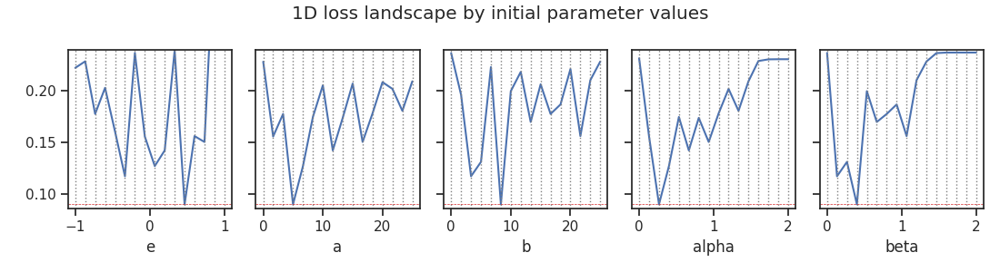
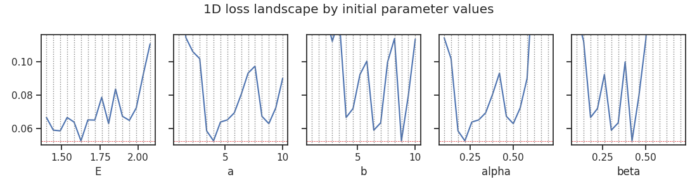
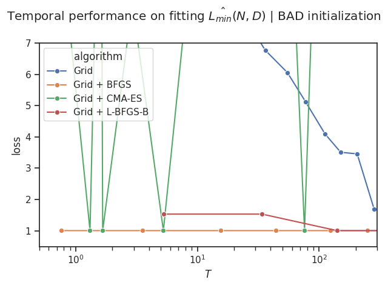
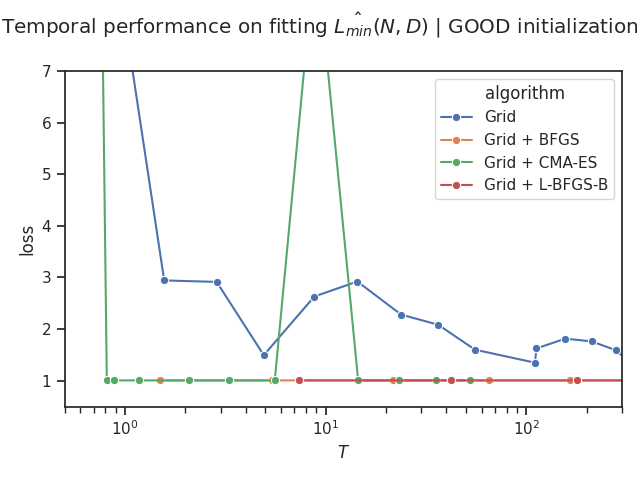
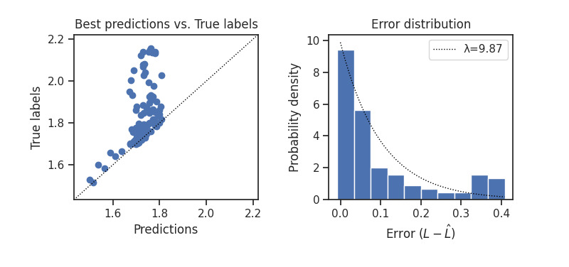
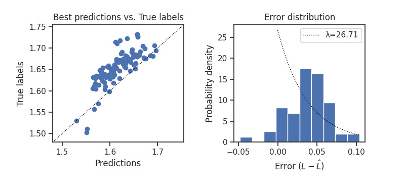

# Tips / Best Practices

Here are a couple of tips and best practices for using `chinchilla`.

## 1. Be meticulous with `param_grid`

To fit a loss predictor $L(N, D | A, B, \alpha, \beta)$ (`Chinchilla.fit`) based on existing training runs, defining the `param_grid` of initial values is critical.
The parametric model is sensitive to the initial distribution, and a well-chosen grid can significantly reduce the risk of underfitting or poor convergence.

### Example: Original Initialization Grid

<!-- > [!NOTE]
> This example will also be demonstrated in the example [**Effectively narrowing down the search space**](examples/llm/param_grid.ipynb). -->

The initialization grid used in the original Chinchilla study looked like this:

> ```python
> """This grid matches the range used in the original paper."""
> num_slices = 16   # Resolution increased from 1,500 -> 1,048,576 combinations for a finer sweep
> cc = Chinchilla(
>     "./",
>     param_grid = dict(
>         e=np.linspace(-1, 1, num_slices),
>         a=np.linspace(0, 25, num_slices),
>         b=np.linspace(0, 25, num_slices),
>         alpha=np.linspace(0, 2, num_slices),
>         beta=np.linspace(0, 2, num_slices)
>     )
>     ...
> )
> cc.sweep_param_grid()  # Visualizes the loss landscape for the grid.
> ```
>
> 

As seen, the loss landscape has sharp minima, making it difficult to converge to a good optimum unless any of the initial guesses happen to be very close to them. This is an example of ***poor initialization***.

### Improving Initialization

To address this, you can refine the parameter search space based on existing training data and prior observations. For example:

- Reduce the range for other parameters based on the stability of their behavior.

- Narrow the range for $E$ to a region around the observed minimum loss.

  This by definition sets the **upper bound** for the irreducible error. In the original, the $e=\log(E)$ range corresponds to [0.367879441, 2.71828183] in linear space, which is largely missing the point

Here’s an improved grid based on this strategy:

```python
param_grid = dict(
    E=np.linspace(1.4, 2.0774, num_slices), # 2.0774: Observed minimum irreducible error
    a=np.linspace(1, 10, num_slices),
    b=np.linspace(1, 10, num_slices),
    alpha=np.linspace(0.1, 0.7, num_slices),
    beta=np.linspace(0.1, 0.7, num_slices)
)
```

And you get:



The minima are smoother and more stable, allowing for easier convergence during optimization.

As a matter of fact, this technique is so effective that even a naive grid search can work almost as good as L-BFGS:

<div style="display: flex; justify-content: center; gap: 1.5rem; align-items: center; font-size: 1.5rem;">
    <div>
        
    </div>
    ➡️
    <div>
      
    </div>
</div>

## 2. Keep `scaling_factor` moderate

Scaling compute according to the loss predictor involves ***extrapolation*** beyond the FLOPs regime used for fitting the predictor.
To avoid overstepping, it's advisable to:

- **Incrementally scale compute** rather than making large jumps.
- ***Continuously update*** the scaling law as a new data point becomes available.

As a rule of thumb, I would suggest using`scaling_factor=2.0` as a good starting point.
This approach balances the compute budget by dedicating roughly half of it to scaling law estimation and the other half to final model training.

## 3. Beware of "failure modes"

When fitting the loss predictor, several common failure modes may arise. These are often tied to poor configurations, including;

- **Insufficient compute for seed models**

  

- **Underfitting due to poor optimization**

  

---

> [!NOTE]
> *The section "General Training Advice" has been removed from this document. In case you still need it, you can find it [here](https://github.com/kyo-takano/chinchilla/blob/3db6ab51a0ceb82855cb66da41f0b8ab663b3857/docs/TIPS.md#general-training-advice)*
