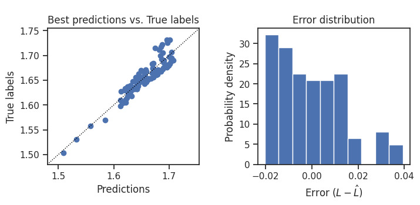
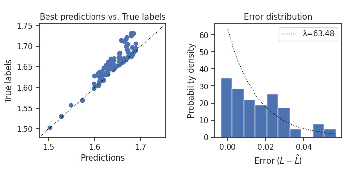
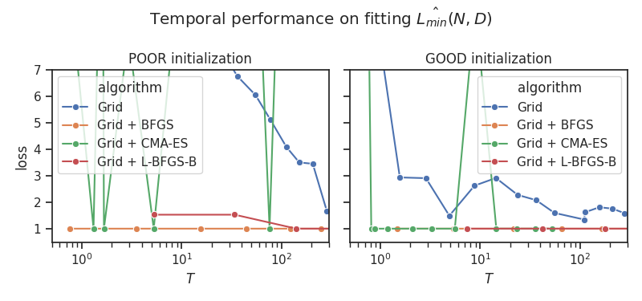

# Changes from Original Chinchilla

This document outlines the key modifications made to our default settings in comparison to the original Chinchilla.
These changes aim to improve the theoretical consistency as well as the performance of the scaling law estimation.

## 1. Loss function: Symmetric → Asymmetric

The loss predictor $L(N,\ D\ |\ A,\ B,\ \alpha,\ \beta)$ aims to capture **_the lower bound of_** the loss achievable with a given allocation $(N, D)$.
However, the original approach utilizes a symmetric loss function (log-Huber) to predict the **_expected_** (mean) loss and does not adequately account for the distribution of errors.

Modeling-wise, the additional loss attributed to the inherent incompleteness of a training setup---which we shall call **a noise term**---should be more exponentially distributed rather than normally.
If we comply with the modelling and assume the errors to be positive and  asymmetrically biased to 0, losses in the right tail of such a distribution would have extensive effects on fitting the loss predictor when using a symmetric function like Huber.

Although you may find a symmetric distribution of errors, it's only _ad hoc_ so, and their choice of Huber to address outliers does *not* address it.

To better model such a distribution and address the limitations of the symmetric loss function, we have shifted to an asymmetric loss function. This **penalizes negative errors more significantly than positive ones**:

\[
f(y, \hat{y}, \lambda)=
\begin{cases}
y - \hat{y},& \text{if } y - \hat{y} > 0\\
\lambda \cdot |y - \hat{y}|, & \text{otherwise}
\end{cases}
\]

This modification more accurately fits the loss predictor to **_the lower bound of_** achievable losses.

Nonetheless, you are free to stick to the original log-Huber or use your own `loss_fn`.

## 2. Weighting loss predictions/losses

Relatedly, the original implementation applies log transformations to both predicted and actual losses before feeding them into the Huber function (implemented as [`chinchilla._metrics.log_huber`](https://github.com/kyo-takano/chinchilla/blob/master/chinchilla/_metrics.py)).

This tweak places more weight on training runs with lower losses (/larger computes) which probably just did not either help or bother in their case of pretraining LLMs, but it lacks a valid justification, considering that cross-entropy losses are already logarithmic.
Moreover, it could lead to unpredictable effects based on the value range (e.g., would not work with latent diffusion models, whose losses often fall <1.0).

Thus, **`chinchilla` applies no weights to actual or predicted losses** by default.
We offer the flexibility to integrate a custom `weight_fn` into the code, but you would need to edit a few lines of code inside `Chinchilla.fit`.

## 3. Flexible numerical scaling for loss predictor parameters

We introduce the option to specify the parameters $E$, $A$, and $B$ of `param_grid` in either linear or logarithmic scale.
To set any of them in log scale, simply lowercase the letters ($e$, $a$, $b$) for logarithmic scaling.

The original logarithmically scales these parameters (seemingly for numerical stability with the subsequent sum-exp operation), but there are no tangible reasons _to_ or _not to_ apply such a transformation.
I would personally suggest that you don't log-scale $E$, but it doesn't really matter fpr $A$ and $B$ as long as they are not too large in linear scale.

## 4. Algorithm: L-BFGS-B → BFGS

I have tested the temporal performance of fdifferent algorithms (including those not shown here) and **BFGS just works best**, regardness of how good the initial parameter grid is.

